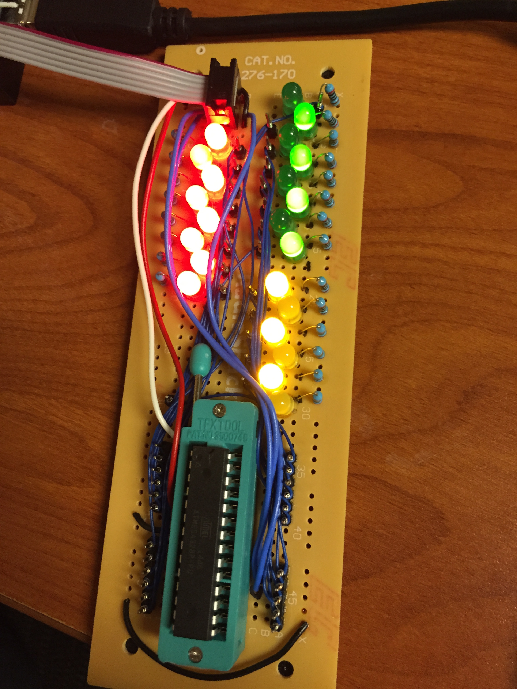

ATmegaxx8-P tester
==================

what
----

this program will flash the pins on registers B, C, and D.

how
---

make a circuit with LEDs and resistors attached to all the register pins on an atmega328p.

it looks like this:

i used a [usbtinyisp](https://learn.adafruit.com/usbtinyisp) from adafruit with avrdude to program my chip but you can use whatever pleases you. change the makefile accordingly, i borrowed it from https://github.com/hexagon5un/AVR-Programming
